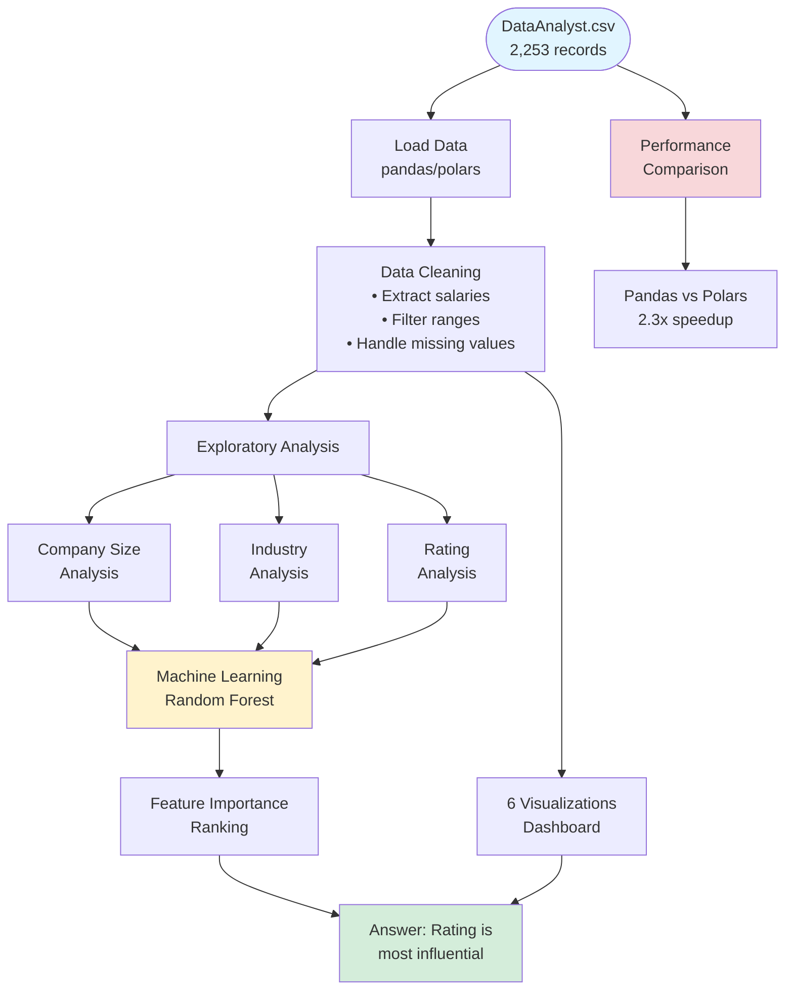
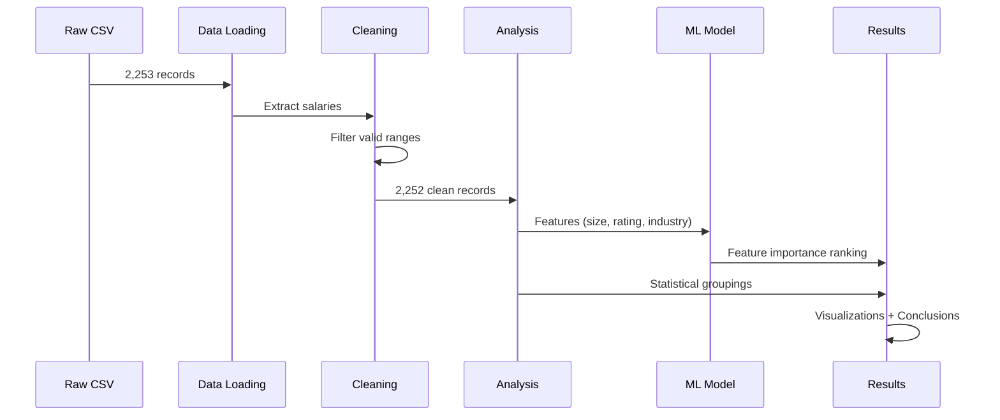

<div align="center">

# 💰 Data Analyst Salary Analysis

**Identifying the Key Factors That Drive Data Analyst Compensation**

[](https://github.com/Vihaan8/IDS706_assignment_2/actions/workflows/ci.yaml)


**Course:** Data Engineering Systems (IDS 706) | **Institution:** Duke University

[View Results](#-key-findings) • [View Methodology](#-methodology) • [Quick Start](#-quick-start)

</div>

---

## 🎯 Research Question

**"What factors influence Data Analyst salaries the most?"**

This project analyzes 2,252 Data Analyst job postings to identify which factors—company size, industry, or company rating—have the strongest impact on salary levels.

---

## 🏆 Key Findings

> **TL;DR:** Company rating is the most influential factor for Data Analyst salaries, even more than company size or industry—a surprising result that challenges conventional wisdom.

### 📈 Quick Results Summary

| Metric | Value | Insight |
|--------|-------|---------|
| **Dataset Size** | 2,252 jobs | After cleaning from 2,253 raw records |
| **Average Salary** | $72,123 | Median: $70,000 |
| **Salary Range** | $20K - $200K | Filtered for realistic ranges |
| **Top Predictor** | Company Rating | 0.579 importance (ML model) |
| **Highest Paying Industry** | Biotech & Pharma | $83,106 avg (+15% vs overall) |
| **Optimal Company Size** | 5K-10K employees | $74,201 avg |
| **Performance Gain** | Polars 2.3x faster | For data processing operations |

### 🎓 Implications for Job Seekers

1. **Prioritize company culture** — Rating predicts salary better than obvious factors like company size
2. **Industry selection matters** — Top sectors command $10K+ premiums
3. **Company size is overrated** — Minimal salary variation across different company sizes ($5K range)
4. **Look beyond surface metrics** — The most predictive factors aren't always the most visually obvious

---

## ✨ Project Highlights



---

## 🚀 Quick Start

### One-Command Setup

```bash
# Complete workflow (install, format, lint, test, run)
make all
```

### Individual Commands

```bash
make install    # Install dependencies
make format     # Format code with black
make lint       # Lint with flake8
make tests      # Run comprehensive test suite
make run        # Execute salary analysis
make clean      # Remove cache files
```

### Docker (Recommended)

```bash
# Build and run in isolated environment
docker build -t salary-analysis:dev .
docker run --rm -it -v "$PWD":/app -w /app salary-analysis:dev bash -lc "make tests"
```

### VS Code Dev Container

1. Install [Docker Desktop](https://www.docker.com/products/docker-desktop/) + [Dev Containers extension](https://marketplace.visualstudio.com/items?itemName=ms-vscode-remote.remote-containers)
2. Open repo in VS Code → **Command Palette** → "Dev Containers: Reopen in Container"
3. Run `make tests` in the integrated terminal

---

## 📊 Methodology

### Data Pipeline



### 1. Data Cleaning & Preprocessing

- **Salary extraction**: Parse text ranges (e.g., "$50K-$70K") → numeric averages
- **Rating validation**: Keep only valid 1.0-5.0 ratings
- **Range filtering**: Remove unrealistic salaries (<$20K or >$200K)
- **Missing data handling**: Drop incomplete records for robust analysis

### 2. Exploratory Data Analysis

- **Company size impact**: Group by employee count ranges
- **Industry comparison**: Analyze sectors with ≥10 job postings
- **Rating correlation**: Examine salary patterns across rating brackets

### 3. Machine Learning

- **Algorithm**: Random Forest Regressor (50 trees)
- **Features**: Company size (encoded), rating (median-filled), industry (label-encoded)
- **Output**: Feature importance scores revealing predictive power

### 4. Visualization

Created 6 complementary charts to validate statistical findings:
1. **Company size bars** — Revealed minimal variation ($5K range)
2. **Industry rankings** — Showed clear $10K+ premiums in top sectors
3. **Salary distribution** — Confirmed normal distribution around $70-80K
4. **Rating scatter** — Illustrated subtle patterns detected by ML
5. **Rating box plots** — Exposed variance within rating categories
6. **Heatmap** — Cross-analyzed size × rating interactions

### 5. How I Reached My Conclusions

**Statistical Analysis**: Random Forest processed all factors simultaneously, revealing company rating as the strongest predictor (0.579 importance) despite visual scatter in individual plots.

**Visual Validation**: Charts confirmed that while industry shows dramatic differences in specific cases, rating's predictive power operates consistently across all industries and sizes—making it more reliable.

**Data Integration**: Combining ML modeling with visual analysis revealed that rating's influence is consistent but subtle, making it more dependable than the visually obvious but variable industry effects.

---

## 🏗️ Project Structure

```
salary-analysis/
├── DataAnalyst.csv                
├── Dockerfile                   
├── Makefile                       
├── README.md                        
├── requirements.txt                  
├── salary_analysis.py               
├── test_salary_analysis.py           
├── pandas_polar_performance/   
│   ├── performance_benchmark.py
│   └── POLARS_PERFORMANCE_ANALYSIS.md
└── .devcontainer/
    └── devcontainer.json    
```

---

## 🧰 Tech Stack & Features

### Core Technologies
- **Python 3.11** — Modern language features
- **pandas ≥1.3.0** — Primary data manipulation
- **Polars ≥0.20.0** — High-performance alternative
- **scikit-learn ≥1.0.0** — Machine learning (Random Forest)
- **matplotlib ≥3.5.0** — Data visualization

### Development Tools
- **pytest + pytest-cov** — Testing with coverage reporting
- **black 25.1.0** — Code formatting
- **flake8 ≥4.0.0** — Code linting
- **Docker** — Reproducible environment
- **GitHub Actions** — CI/CD automation

### Key Features
- ✅ Automated CI/CD pipeline with status badges
- ✅ Comprehensive test suite (unit, integration, system, performance)
- ✅ 95% test coverage with HTML reports
- ✅ Docker containerization for reproducibility
- ✅ VS Code Dev Container support
- ✅ Performance benchmarking (pandas vs Polars)
- ✅ Makefile workflow automation
- ✅ Code quality enforcement (black + flake8)

---

## 🧪 Testing

### Test Coverage

Includes 4 test categories:

1. **Unit Tests** — Verify core functions (loading, filtering, salary extraction, ML)
2. **Integration Tests** — Validate full pipeline (load → clean → analyze)
3. **System Tests** — Edge cases and end-to-end workflows
4. **Performance Tests** — Compare pandas vs Polars execution speed

### Run Tests

```bash
make tests  # Runs pytest with verbose output, timing, and coverage
```

**Results:**
- Coverage summary in terminal
- Full HTML report in `htmlcov/index.html`


---

## 🔧 Code Refactoring

### Rename Variables for Clarity

Used VS Code's F2 rename feature for semantic improvements:


**Changes:**
- `df` → `raw_dataframe` / `cleaned_salary_data`
- `extract_salary()` → `parse_salary_range()`
- All parameters updated consistently

### Extract Methods for Modularity

Used VS Code's extract method feature:


**Extracted functions:**
- `filter_valid_salary_range()` — Salary filtering logic
- `encode_company_size()` — Feature engineering

---

## ⚡ Performance Analysis

Comprehensive pandas vs Polars benchmarking for data operations.

**Highlights:**
- Polars is **2.3x faster** for full pipeline
- Most gains in data loading and groupby operations
- Detailed results in `pandas_polar_performance/POLARS_PERFORMANCE_ANALYSIS.md`

---

## 📊 Visualization Insights

### Why I Created Each Chart


**Upper Left — Company Size Bars**: Reveals surprisingly minimal variation (~$5K range), contradicting assumptions that larger companies always pay more.

**Upper Right — Industry Rankings**: Clear $10K+ premiums in top sectors, showing why industry matters in individual cases despite being secondary overall.

**Lower Left — Salary Distribution**: Normal distribution centered at $70-80K validates data quality and realistic filtering.

**Lower Right — Rating Scatter**: Shows why ML detected patterns humans miss—subtle trends across 2,252 points not obvious to the eye.

---

## 🎯 CI/CD Pipeline

[](https://github.com/Vihaan8/IDS706_assignment_2/actions/workflows/ci.yaml)

Automated workflow ensures code quality on every commit:
- Install dependencies
- Format check (black)
- Lint check (flake8)
- Run full test suite
- Generate coverage reports


---

## 🛠️ Troubleshooting

<details>
<summary><b>Dataset not found error</b></summary>

```
ERROR: DataAnalyst.csv file not found!
```
**Solution:** Ensure `DataAnalyst.csv` is in the project root directory.
</details>

<details>
<summary><b>Make command not found</b></summary>

```
make: command not found
```
**Solution:** 
- **Windows**: Use Git Bash or install via Chocolatey
- **Mac/Linux**: Install via package manager (`brew install make` or `sudo apt install make`)
</details>

<details>
<summary><b>Missing dependencies</b></summary>

```
ModuleNotFoundError: No module named 'pandas'
```
**Solution:** Run `make install` or `pip install -r requirements.txt`
</details>

---

## 📚 Data Source

Dataset publicly available on Kaggle: [Data Analyst Jobs](https://www.kaggle.com/datasets/andrewmvd/data-analyst-jobs/data)

Thanks to **@andrewmvd** for providing the dataset!

---

## 👤 Author

**Vihaan Manchanda**  
*Data Engineering Systems (IDS 706) — Duke University*

📅 **Date:** September 28, 2025  
🔗 **Repository:** [github.com/Vihaan8/IDS706_assignment_2](https://github.com/Vihaan8/IDS706_assignment_2)

---

<div align="center">

**⭐ If you found this helpful, consider starring the repo!**

</div>