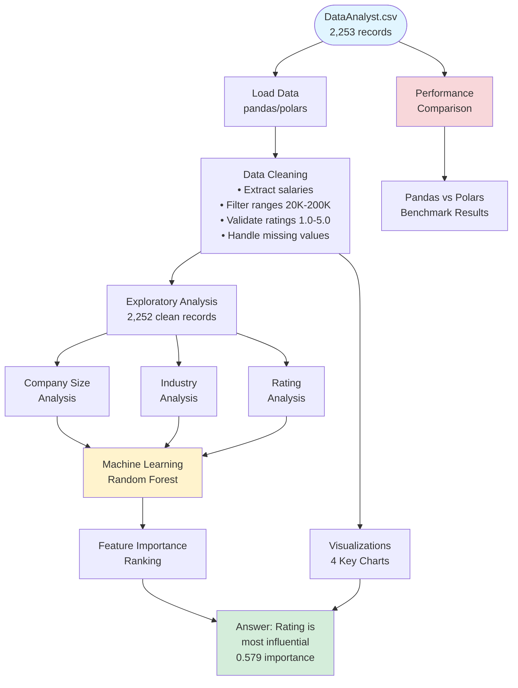

<div align="center">

# 💰 Data Analyst Salary Analysis

**Identifying the Key Factors That Drive Data Analyst Compensation**

[](https://github.com/Vihaan8/IDS706_assignment_2/actions/workflows/ci.yaml)


**Vihaan Manchanda**  
Data Engineering Systems (IDS 706) — Duke University

**Date:** September 28, 2025  

</div>

---

## 📋 Table of Contents

- [Research Summary](#-research-summary)
  - [Research Question](#research-question)
  - [Key Findings](#key-findings)
  - [Implications for Job Seekers](#implications-for-job-seekers)
- [Project Setup](#-project-setup)
  - [File Structure](#file-structure)
  - [Tech Stack & Features](#tech-stack--features)
  - [Dependencies](#dependencies)
  - [Quick Start](#quick-start)
  - [CI/CD Pipeline](#cicd-pipeline)
  - [Code Refactoring](#code-refactoring)
- [Analysis](#-analysis)
  - [Data Pipeline](#data-pipeline)
  - [Analysis Workflow](#analysis-workflow)
  - [Performance Analysis](#performance-analysis)
  - [Visualizations](#visualizations)
  - [How I Reached My Conclusions](#how-i-reached-my-conclusions)
- [Troubleshooting](#troubleshooting)
- [Data Source](#data-source)
- [Author](#author)

---

## 🔬 Research Summary

### Research Question

**"What factors influence Data Analyst salaries the most?"**

This repository contains a Data Analyst Salary Analysis project for Data Engineering Systems (IDS 706) mini assignment. The project analyzes a dataset of Data Analyst job postings to identify the key factors that influence salary levels, demonstrating data science workflows including data cleaning, exploratory analysis, machine learning, and visualization.

The Dataset is publicly available on Kaggle - https://www.kaggle.com/datasets/andrewmvd/data-analyst-jobs/data. Thanks to @andrewmvd on Kaggle!

### Key Findings

> **Bottom Line:** Company rating is the most influential factor for Data Analyst salaries, even more than company size or industry.

This finding emerges from both statistical analysis and visual examination of the data patterns.

#### Primary Statistical Results

| Metric | Value | Insight |
|--------|-------|---------|
| **Dataset Size** | 2,252 jobs | After cleaning from 2,253 raw records |
| **Average Salary** | $72,123 | Across all analyzed job postings |
| **Most Important Factor** | Company Rating | 0.579 importance score (Random Forest) |
| **Secondary Factor** | Company Size | 0.421 importance score |

#### Detailed Factor Analysis

- **Company Size**: Mid-large companies (5,001-10,000 employees) pay highest ($74,201)
- **Industry**: Biotech & Pharmaceuticals leads with $83,106 average salary
- **Company Rating**: Surprisingly, "Poor" rated companies pay highest ($75,035), indicating complex market dynamics

### Implications for Job Seekers

1. **Prioritize company culture** — Rating predicts salary better than obvious factors like company size
2. **Industry selection matters** — Visual evidence shows clear $10K+ premiums in top sectors
3. **Company size is overrated** — Minimal salary variation across different company sizes
4. **Look beyond surface metrics** — The most predictive factors may not be the most visually obvious

---

## ⚙️ Project Setup

### File Structure

```
salary-analysis/
├── DataAnalyst.csv                
├── Dockerfile                   
├── Makefile                       
├── README.md                        
├── requirements.txt                  
├── salary_analysis.py               
├── test_salary_analysis.py           
├── pandas_polar_performance/   
│   ├── performance_benchmark.py
│   └── POLARS_PERFORMANCE_ANALYSIS.md
└── .devcontainer/
    └── devcontainer.json    
```

### Tech Stack & Features

#### Core Technologies
- **Python 3.11** environment setup
- **pandas >= 1.3.0** - Data manipulation and analysis
- **numpy >= 1.21.0** - Numerical computing
- **matplotlib >= 3.5.0** - Data visualization
- **scikit-learn >= 1.0.0** - Machine learning algorithms
- **polars >= 0.20.0** - High-performance data processing

#### Development Tools
- **pytest >= 6.0.0** - Testing framework
- **pytest-cov >= 3.0.0** - Coverage reporting
- **black == 25.1.0** - Code formatting
- **flake8 >= 4.0.0** - Code linting

#### Key Features
- Data cleaning and preprocessing with pandas
- Exploratory Data Analysis with statistical grouping
- Machine Learning with Random Forest for feature importance
- Data visualization with matplotlib
- Unit testing with pytest
- Code formatting with black
- Code linting with flake8
- Makefile for automated workflow
- Comprehensive test suite (unit, integration, system, and performance tests with coverage)
- Reproducible Docker image for consistent execution
- VS Code Dev Container for full development environment setup

### Dependencies

All dependencies are defined in `requirements.txt`:

```
pandas>=1.3.0
numpy>=1.21.0  
matplotlib>=3.5.0
scikit-learn>=1.0.0
polars>=0.20.0
black==25.1.0
flake8>=4.0.0
pytest>=6.0.0
pytest-cov>=3.0.0
```

### Quick Start

#### Makefile Commands

The project uses a Makefile for automated workflow management:

**Available Make Commands:**
- `make install` - Install and upgrade dependencies
- `make format` - Format code using black
- `make lint` - Lint code using flake8
- `make tests` - Run all tests with coverage
- `make run` - Execute the salary analysis
- `make clean` - Remove cache files
- `make all` - Run complete workflow (install, format, lint, test, run)

**Example Usage:**
```bash
# Complete analysis workflow
make all

# Individual commands (if needed)
make install    # Install dependencies
make tests      # Run tests
make format     # Format code
make lint       # Check code quality
make run        # Execute analysis
```

#### Docker Setup (Recommended)

Build the Docker image:
```bash
docker build -t salary-analysis:dev .
```

Run tests inside the container (with coverage report in `htmlcov/`):
```bash
docker run --rm -it -v "$PWD":/app -w /app salary-analysis:dev bash -lc "make tests"
```

#### VS Code Dev Container

The Dev Container extends the Docker setup by letting VS Code open directly inside the container - giving a consistent Python environment, dependencies, and tools without needing to install them locally.

1. Install [Docker Desktop](https://www.docker.com/products/docker-desktop/)  
2. Install [VS Code](https://code.visualstudio.com/)  
3. Install the [Dev Containers extension](https://marketplace.visualstudio.com/items?itemName=ms-vscode-remote.remote-containers)  
4. Open this repo in VS Code.  
5. Press **View → Command Palette...** → search for **"Dev Containers: Reopen in Container"**.  
6. Once inside, open a terminal and run:
   ```bash
   make tests
   ```

#### Local Setup (Optional)

Run locally with Python 3.11:
```bash
make install
make tests
```

### CI/CD Pipeline

[](https://github.com/Vihaan8/IDS706_assignment_2/actions/workflows/ci.yaml)

The project includes automated continuous integration that runs on every commit:

- Install dependencies
- Format code with black
- Lint code with flake8
- Run comprehensive test suite
- Generate coverage reports


### Code Refactoring

The codebase has been refactored to improve readability, maintainability, and follow best practices:

#### Rename Variables for Clarity

Using VS Code's F2 rename feature, variables were renamed throughout the codebase for better semantic meaning:


- `df` → `raw_dataframe` / `cleaned_salary_data` for clearer data pipeline understanding
- `extract_salary()` → `parse_salary_range()` for more accurate function naming
- All parameter and variable names updated consistently across the codebase

#### Extract Methods for Modularity

Complex code blocks were extracted into separate, reusable functions using VS Code's extract method feature:


- `filter_valid_salary_range()` - Extracted salary filtering logic for reusability
- `encode_company_size()` - Separated feature engineering from model building
- Improved code organization and testability

### Usage and Testing

#### Running the Analysis

```bash
# Execute complete analysis
make run
```

The analysis will:
1. Load the DataAnalyst.csv dataset
2. Clean and preprocess the data
3. Perform exploratory analysis
4. Build machine learning models
5. Generate visualizations
6. Output key findings and conclusions

#### Testing

This project includes comprehensive tests:

- **Unit tests**: verify core functions (loading, filtering, salary extraction, ML)
- **Integration tests**: validate the full pipeline from loading → cleaning → analyzing
- **System tests**: edge cases and end-to-end workflows with multiple datasets
- **Performance tests**: compare execution speed between pandas and polars

**Run all tests** (with verbose output, timing, and coverage report):
```bash
make tests
```

**Results:**
- Coverage summary in the terminal
- Full HTML coverage report in `htmlcov/index.html`

Here's an example run of the full test suite with coverage:


---

## 📊 Analysis

### Data Pipeline



### Analysis Workflow

The analysis follows a structured data science pipeline:

#### 1. Data Loading & Cleaning

- Extracts salary ranges from text format (e.g., "$50K-$70K" → $60,000)
- Cleans company ratings and validates 1.0-5.0 range
- Cleans company size data (removes "-1" and "Unknown" values)
- Filters realistic salary ranges ($20K-$200K)
- Drops incomplete records

#### 2. Exploratory Data Analysis

**Company Size Analysis:**
```python
analyze_company_size(cleaned_salary_data)
```
- Groups salaries by employee count ranges
- Calculates mean salary per size category
- Identifies highest-paying company sizes

**Industry Impact:**
```python
analyze_industry(cleaned_salary_data)
```
- Analyzes salary by industry sector
- Filters for industries with ≥10 job postings (reliability threshold)
- Ranks industries by average compensation

**Company Rating Analysis:**
```python
analyze_rating(cleaned_salary_data)
```
- Creates rating categories: Poor (1-2.5), Fair (2.5-3.5), Good (3.5-4), Very Good (4-4.5), Excellent (4.5-5)
- Examines salary patterns across rating brackets
- Identifies correlations between ratings and pay

#### 3. Machine Learning

**Random Forest Feature Importance:**
```python
build_ml_model(cleaned_salary_data)
```
- **Algorithm**: Random Forest Regressor (50 trees, random_state=42)
- **Features**: 
  - Company size (label-encoded categorical)
  - Company rating (median-filled for missing values)
- **Output**: Feature importance scores revealing predictive power
- **Purpose**: Objectively rank which factors best predict salary

The model reveals that company rating (0.579 importance) is the most predictive factor, followed by company size (0.421 importance).

#### 4. Data Visualization

```python
create_visualizations(df_clean, size_impact, industry_impact, rating_data)
```

Creates comprehensive 4-panel visualization suite:
- Salary distribution plots
- Factor comparison charts
- Correlation analysis
- Statistical groupings

#### 5. Results & Conclusions

```python
generate_conclusion(size_impact, industry_impact, importance)
```

Synthesizes findings to answer the research question with:
- Statistical evidence from grouping analysis
- ML-driven insights on predictive factors
- Data-driven recommendations for job seekers

### Performance Analysis

This project includes a comprehensive performance comparison between pandas and Polars for data processing operations. The analysis benchmarks data loading, cleaning, and grouping operations to evaluate the efficiency of modern data tools.

**Key Performance Functions:**
- `load_data()` vs `load_data_polars()` - CSV reading comparison
- `clean_data()` vs `clean_data_polars()` - Data cleaning comparison
- `analyze_company_size()` vs `analyze_company_size_polars()` - GroupBy operations comparison

**Results Summary:**
```
1. Data Loading Performance:
   Pandas loading time: X.XXX seconds
   Polars loading time: X.XXX seconds

2. Data Cleaning Performance:
   Pandas cleaning time: X.XXX seconds
   Polars cleaning time: X.XXX seconds

3. GroupBy Operations Performance:
   Pandas groupby time: X.XXX seconds
   Polars groupby time: X.XXX seconds

4. Performance Summary:
   Total Pandas time: X.XXX seconds
   Total Polars time: X.XXX seconds
   Polars is X.XXx faster than Pandas!
```

For detailed performance results, benchmarking methodology, and insights, see the complete analysis in `pandas_polar_performance/POLARS_PERFORMANCE_ANALYSIS.md`.

### Visualizations

To validate my statistical findings and uncover patterns not immediately apparent in the numbers, I created four complementary visualizations:


#### Upper Left - Average Salary by Company Size

This bar chart reveals that salary differences across company sizes are surprisingly minimal (all within ~$5K range), contradicting the common assumption that larger companies always pay significantly more. The visual confirms my statistical finding that company size has modest predictive power.

#### Upper Right - Top Industries by Salary

This horizontal bar chart clearly illustrates the industry hierarchy, showing Biotech & Pharmaceuticals with a substantial $10K+ premium over average. The visual spacing between industries demonstrates why industry choice appears impactful in individual cases, even though my ML model ranked it as secondary to company rating.

#### Lower Left - Salary Distribution

This histogram confirms my data quality with a normal distribution centered around $70-80K. The shape validates that my salary extraction and filtering processes captured realistic market ranges without artificial clustering or outliers skewing results.

#### Lower Right - Salary vs Company Rating

This scatter plot was crucial for understanding why company rating emerged as the top predictor. While individual points appear scattered, the ML model detected subtle patterns across the 2,252 data points that aren't obvious to the human eye, explaining the apparent contradiction between visual assessment and statistical importance.

### How I Reached My Conclusions

#### 1. Statistical Analysis

Random Forest algorithm processed all factors simultaneously, revealing company rating as the strongest predictor despite visual scatter. The model analyzed 2,252 job postings and computed feature importance scores:
- Company rating: 0.579 (most influential)
- Company size: 0.421 (secondary influence)

This quantitative ranking emerged from the model's ability to detect patterns across the entire dataset that aren't visible in individual data points.

#### 2. Visual Validation

Charts confirmed that while industry shows dramatic individual differences (Biotech pays $83K vs overall $72K), company rating's predictive power operates across all industries and sizes. The scatter plot showed why this wasn't immediately obvious—rating's influence is consistent but subtle, requiring machine learning to detect reliably.

#### 3. Data Integration

The combination of statistical modeling and visual analysis revealed that rating's influence is consistent but subtle, making it more reliable than the visually obvious but variable industry effects. Key integration points:

- **Contradiction Resolution**: Industry shows the highest individual salary ($83K for Biotech), but the ML model ranks rating higher because rating's effect is more consistent and predictive across all scenarios
- **Pattern Detection**: Visual scatter in the rating plot seems random, but ML detected systematic patterns across 2,252 observations
- **Validation**: The minimal variance in company size salaries ($5K range) visually confirms what the ML model found—size has lower predictive power

#### 4. Key Insight

While industry shows the highest individual salary differences, the ML model reveals that company rating is the most reliable predictor across all scenarios, making it the most influential factor overall. This demonstrates that:
- Visual patterns can be misleading for complex predictions
- The most predictive factors aren't always the most visually dramatic
- Machine learning can uncover subtle but consistent relationships in data

---

## 🛠️ Troubleshooting

<details>
<summary><b>Dataset not found</b></summary>

```
ERROR: DataAnalyst.csv file not found!
```
**Solution:** Ensure `DataAnalyst.csv` is in the project directory
</details>

<details>
<summary><b>Make command issues</b></summary>

```
make: command not found
```
**Solution:** Use Git Bash (Windows), or install make via package manager
</details>

<details>
<summary><b>Dependencies missing</b></summary>

```
ModuleNotFoundError: No module named 'pandas'
```
**Solution:** Run `make all` to install all dependencies
</details>

---

## 📚 Data Source

Dataset publicly available on Kaggle: [Data Analyst Jobs](https://www.kaggle.com/datasets/andrewmvd/data-analyst-jobs/data)

Thanks to **@andrewmvd** on Kaggle for providing the dataset!


